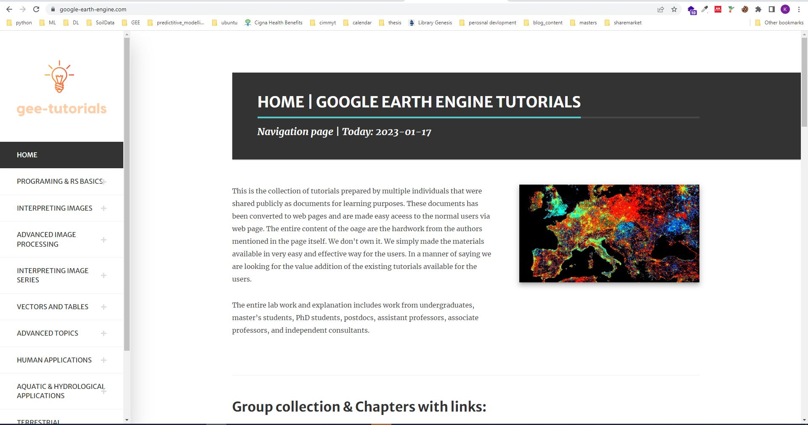

# GOOGLE EARTH ENGINE TUTORIALS

We have included the detail explaination of the cocepts in the blog link below.. Please do visit the blog for details and give feedback if you have any.
https://google-earth-engine.com/

    

## Background
 

This is the collection of tutorials prepared by multiple individuals that were shared publicly as documents for learning purposes. These documents has been converted to web pages and are made easy aceess to the normal users via web page. The entire content of the oage are the hardwork from the authors mentioned in the page itself. We don't own it. We simply made the materials available in very easy and effective way for the users. In a manner of saying we are looking for the value addition of the existing tutorials available for the users.

 

The entire lab work and explanation includes work from undergraduates, master’s students, PhD students, postdocs, assistant professors, associate professors, and independent consultants.

 

### HTML page output for blog is as follows:
 

    

 

# Part F6: Advanced Topics

Although you now know the most basic fundamentals of Earth Engine, there is still much more that can be done. The Part presents some advanced topics that can help expand your skill set for doing larger and more complex projects. These include tools for sharing code among users, scaling up with efficient project design, creating apps for non-expert users, and combining R with other information processing platforms.

# Chapter F6.0: Advanced Raster Visualization

## Authors
Gennadii Donchyts, Fedor Baart

## Overview
This chapter should help users of Earth Engine to better understand raster data by applying visualization algorithms such as hillshading, hill shadows, and custom colormaps. We will also learn how image collection datasets can be explored by animating them as well as by annotating with text labels, using, for example, attributes of images or values queried from images.

## Learning Outcomes
 - Understanding why perceptually uniform colormaps are better to present data and using them efficiently for raster visualization.
 - Using palettes with images before and after remapping values.
 - Adding text annotations when visualizing images or features.
 - Animating image collections in multiple ways (animated GIFs, exporting video clips, interactive animations with UI controls).
 - Adding hillshading and shadows to help visualize raster datasets.

## Link for details:
https://google-earth-engine.com/Advanced-Topics/Advanced-Raster-Visualization/

# Invitation for collaborators:
Please feel free to contribute to the document. Let's try bring the spatial data science contents together so that it would be easier for every one to learn and share the knowledge. You can also provide your valuable suggestion from our contact page.

https://google-earth-engine.com/contact/
